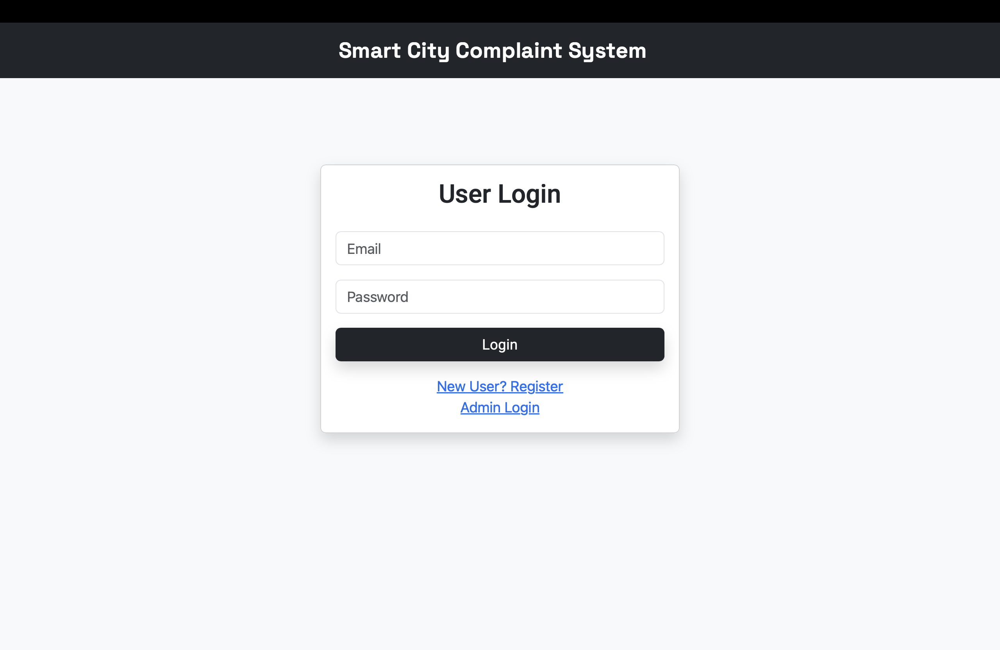
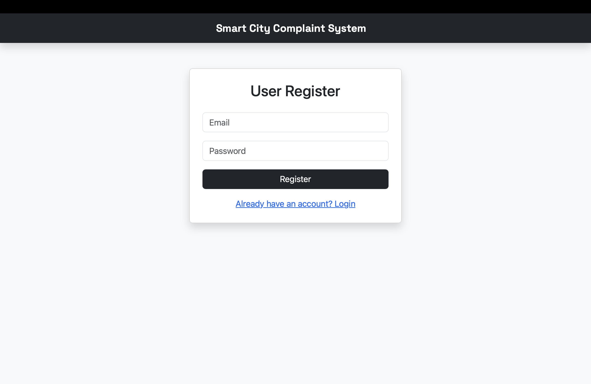
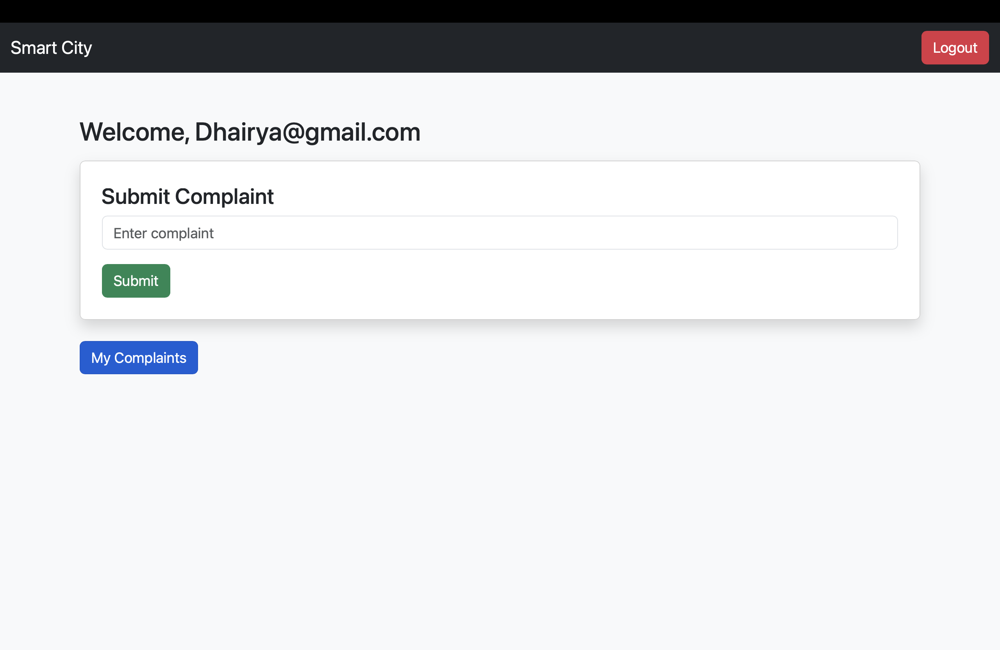
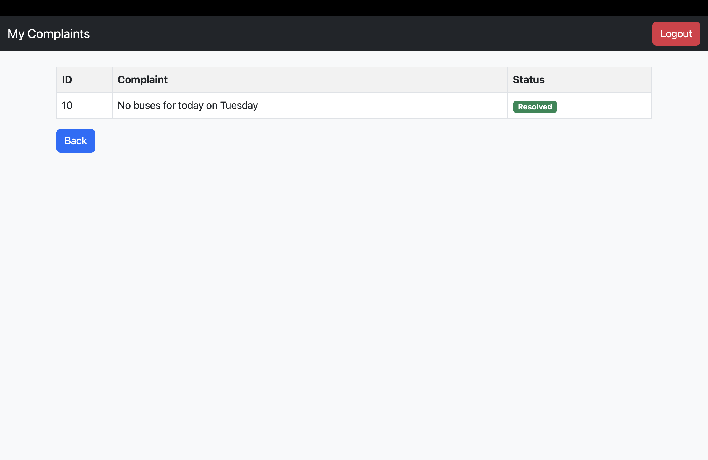
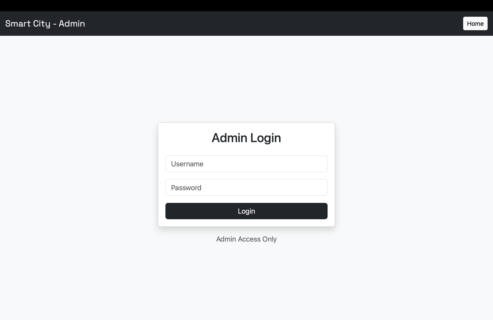

# 🚀 Smart City Complaint Management System

## 📌 Overview
The Smart City Complaint Management System is a web-based application that allows users to register, log in, and submit complaints related to city issues. An admin can manage, update, and resolve complaints through a dedicated dashboard.

---

## 🎯 Features

### 👤 User Module
- User Registration & Login
- Submit Complaints
- View Personal Complaints
- Track Complaint Status (Pending / Resolved)
- Logout Functionality

### 🛠️ Admin Module
- Admin Login
- View All Complaints
- Update Complaint Status
- Delete Complaints
- Dashboard with Total Complaints Count

---

## 🧱 Tech Stack

- **Frontend:** JSP, HTML, CSS, Bootstrap  
- **Backend:** Java Servlets (JDBC)  
- **Database:** MySQL (XAMPP)  
- **Server:** Apache Tomcat  

---

## 🏗️ Architecture

This project follows the **MVC (Model-View-Controller)** pattern:

- **Model:** MySQL Database  
- **View:** JSP Pages  
- **Controller:** Java Servlets  

---

## ▶️ How to Run Locally

1. Clone the repository
2. Import project into Eclipse
3. Add MySQL Connector JAR
4. Start XAMPP (Apache + MySQL)
5. Import database using phpMyAdmin
6. Run project on Tomcat Server

---

## 🔐 Default Credentials

### Admin Login:
- Username: `admin`
- Password: `1234`

---

## 📸 Screenshots

### 🔐 Login Page

### 📝 Register Page

### 🏠 User Dashboard

### ✅ User Complaints

### 🔐 Admin Login 

### 🛠️ Admin Panel

---

## 🚀 Future Enhancements

- Forgot Password (Email/OTP)
- User Profile Management
- Complaint Categories
- Deployment on Cloud (AWS)

---

## 👨‍💻 Author

- Dhairya Parmar
- Aryan Parmar
- Nikunj Nanera

---

## ⭐ Project Status

✔ Completed  
✔ Fully Functional  
✔ Ready for Deployment  
